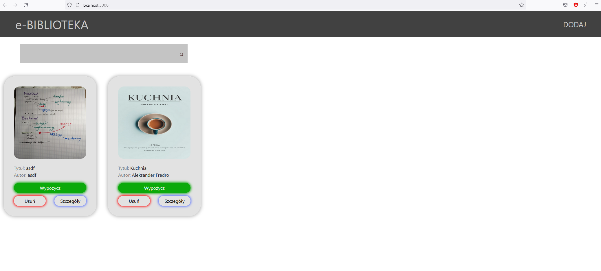
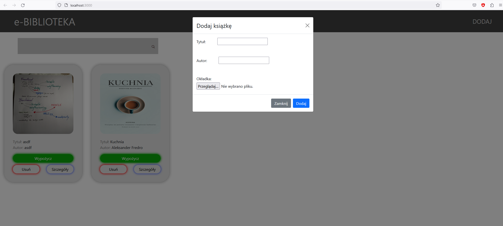
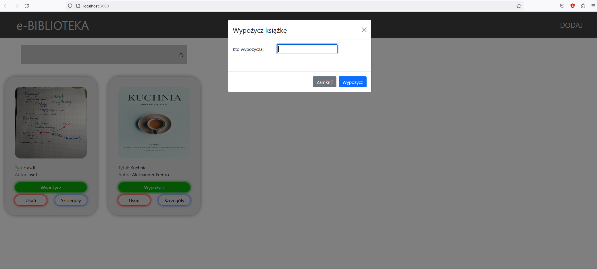
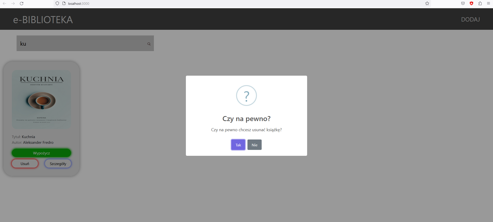
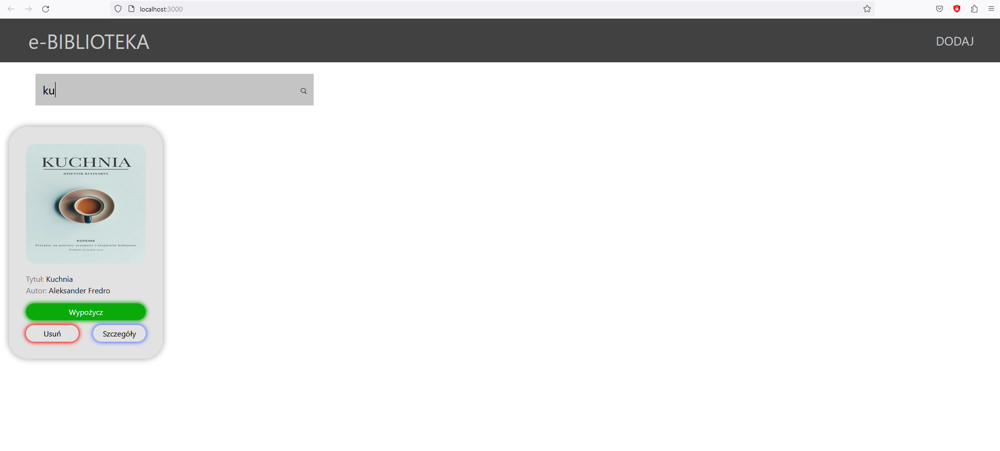

# Wypożyczalnia książek
## Opis aplikacji

Wypożyczalnia książek to aplikacja umożliwiająca prowadzenie ewidencji książek w bibliotece. Aplikacja została stworzona z wykorzystaniem technologii React i TypeScript po stronie klienta oraz Django i Python po stronie serwera. Aplikacja jest typu REST API, a do jej budowy został wykorzystany Django REST framework.
Funkcjonalności systemu

Aplikacja umożliwia:

- dodawanie książek, czyli tytułu, autora oraz zdjęcia okładki
- usuwanie rekordów
- podgląd rekordów
- wypożyczanie książek, co zmienia jej status na "niedostępny"
- filtrowanie oraz wyszukiwanie książek według tytułu lub autora

Wymagania

Aby uruchomić aplikację, należy zainstalować:

    Node.js
    Python

Frontend i backend są dwoma osobnymi serwerami.
W folderze `frontend` uruchamiamy komendę `npm i`. Następnie aby uruchomić serwer używamy komendy `npm start`.
W folderze `backend` uruchamiamy komendy:
```
pip install django
pip install djangorestframework
python manage.py makemigrations
python manage.py migrate
```
Następnie aby uruchomić serwer backendu używamy komendy `python manage.py runserver`

# Screeny

## Pulpit główny


## Dodawanie


## Wypożyczanie


## Usuwanie


## Wyszukiwanie
